

# CompanyRust, воровство аккаунтов и не только. 

Всем привет.

В данной статье расскажу как владелец сервера **CompanyRust**, [Aloyya](https://www.youtube.com/@aloyyarust) может скрытно воровать ваши аккаунты, грузить вам любые файлы и выполнять их, а так же использовать это все **ради собственной выгоды**.

История началась где-то с начала ноября, когда я решил сделать чит на данный проект ради того чтобы поиграть с друзьями.

В проекте присутствует плагин, написанный на C#, который может делать совершенно непредсказанные действия.

## Воровство аккаунтов

В telegram/discord каналах данного проекта была запущена акция:
`"Уважаемые игроки, запускаем систему бонусов для вас и ваших друзей, теперь при открытии Updater у вас будет возможность помочь серверу в развитии и получить бесплатную привилегию для вас и ваших друзей."` бла бла бла.

В некоторых местах люди уже постили про стиллер([Пост в вк](https://vk.com/rustdevbro?w=wall-212874867_33555)). Я расскажу более детально что и как происходит.

Когда вы запускаете апдейтер, в нем будет кнопка `"Получить привелегию"`.
Если на нее нажать, то выполнится данная функция:

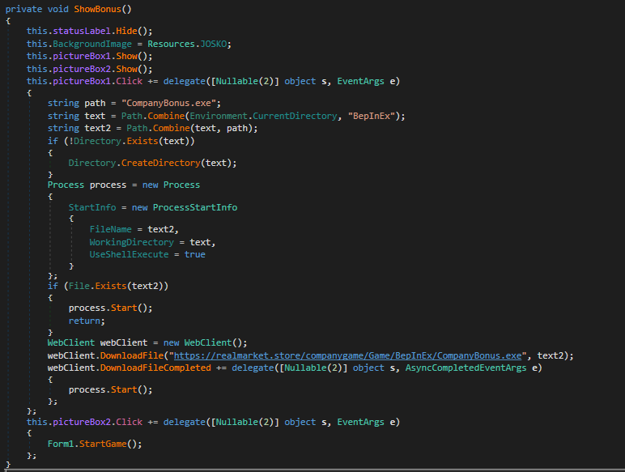

Кратко расскажу что она делает:
1. Создает объект типа Process, который позволяет запускать программы и т.д.
2. Проверяет наличие файла CompanyBonus.exe
3. Если он присутствует, то запускает его.
4. Если нет, **то скачивает с сайта и запускает**(Уже похоже на малварь).

Расскажу про сам файл:
Открыв его в IDA Pro, в функции main, получив псевдокод мы видим это:

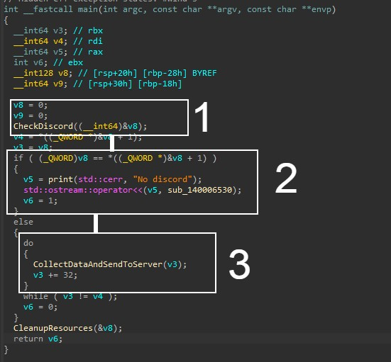

Первый блок(1 на скриншоте) Собирает информацию об установленных приложениях в директории AppData и сохраняет в буффер.
Второй блок(2 на скриншоте) делает проверку на установленный дискорд, и если его нет, то выводит в консоль что он не установлен.
В случае если он установлен, то переходит ко второму блоку.

Третий блок(3 на скриншоте) вызывает функцию, которая собирает **токен и отправляет на сервер**.

**Перейдем к первой функции CheckDiscord:**

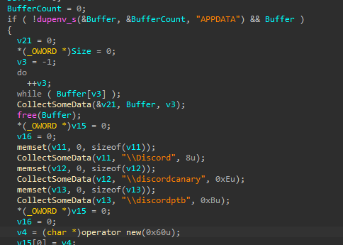

Заходит в директорию AppData и собирает информацию о различных дискордах

**Переходим к функции CollectDataAndSendToServer, покажу скриншоты, вы сами все поймете:**

<figure>
  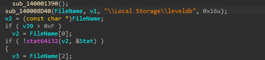
  <figcaption>Собирает данные из дискорда</figcaption>
</figure>

Если кто-то не знает, то дискорд это просто веб страница, которая открывается как приложение.

В этой функции далее нет почти ничего интересного, но вот еще один скриншот:

<figure>
  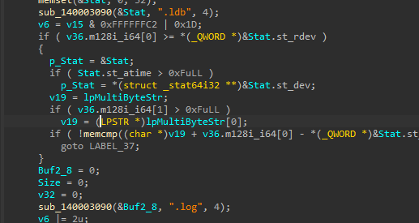
  <figcaption>Собирает еще данные</figcaption>
</figure>

Далее в ней есть переходы к другим функциям, и в итоге перейдем к вызову самой важной:

<figure>
  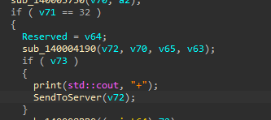
  <figcaption>Печатает в консоль + и отправляет на сервер</figcaption>
</figure>

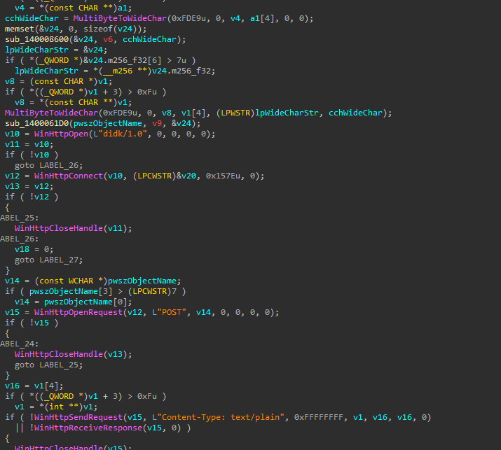

Здесь она инициализирует подключение к их серверу через встроенную библиотеку Windows WinHttp с такими параметрами:

1. **UserAgent: "didk/1.0"**
2. **RequestMethod: "POST"**
3. **ContentType: "Content-Type: text/plain"**

То есть вы нам оффициально говорите, что наши данные никак не передаются никуда!!!!!! Хахах смешно:

<figure>
  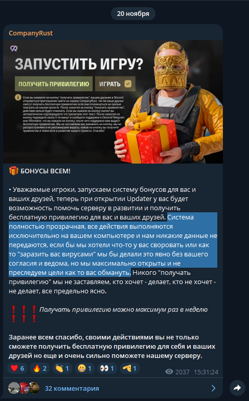
  <figcaption>"Система полностью прозрачная, все действия выполняются исключительно на вашем компьютере и нам никакие данные не передаются, если бы мы хотели что-то у вас своровать или как то "заразить вас вирусами"</figcaption>
</figure>

## Грузим любой файл и запускаем его.

В CompanyBonus.exe мы заметили только дискорд, НО! Я вам не показал еще кое-что:

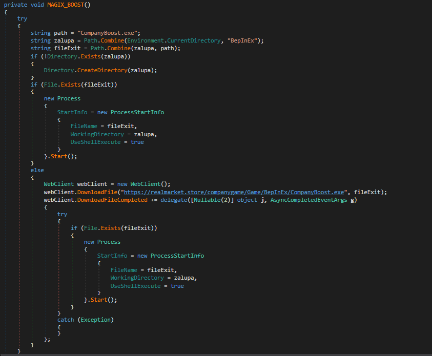

В апдейтере присутствует еще одна функция, которая делает то же самое что и та, про которую я рассказывал ранее, однако она ведет на несуществующий файл на сервере:

<figure>
  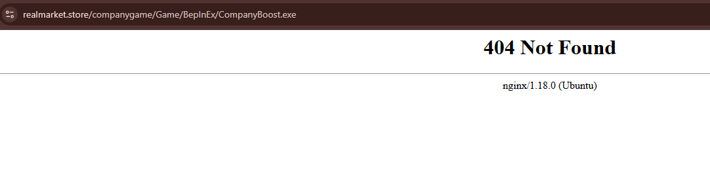
  <figcaption>При открытии ссылки в браузере</figcaption>
</figure>

Запускается он при старте апдейтера:

<figure>
  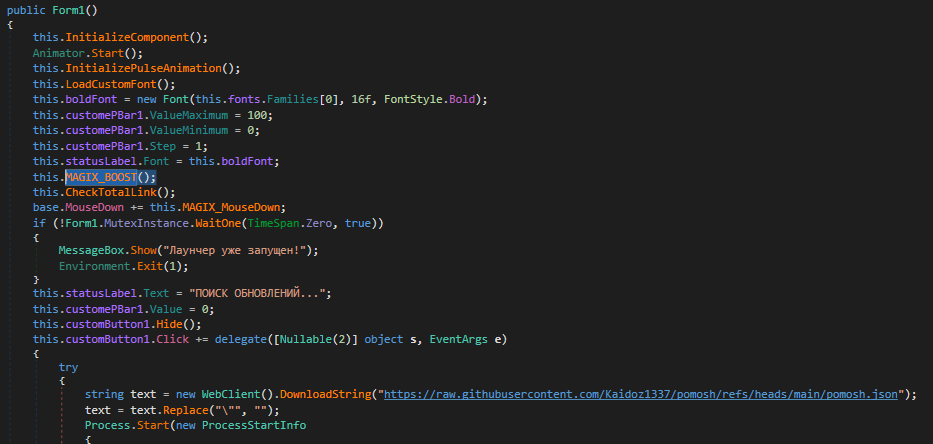
  <figcaption>MAGIX_BOOST</figcaption>
</figure>

Вытащить нам его не удалось, к сожалению.

А вдруг они это используют для подгруза различных файлов на ваш компьютер?
Червей(Backdoor)/Удаленного доступа(RAT)/Более продвинутых стиллеров?

Так же их плагин может выполнять любые файлы/скачивать любые файлы/делать все что угодно.

К примеру может скрытно запустить апдейтер, который запустит инфицированный файл и украдет у вас все данные.

## Использование ради собственной выгоды

После того как моего кента вызвали на проверку и пробанили, ему подгрузили стиллер, который своровал все данные на компьютере: Cookie браузеров, Discord токен, Telegram TDATA.

На его telegram аккаунт зашли и украли NFT Подарки на сумму 80 долларов и 9 долларов в криптоботе.

Казалось бы, сумма не значительная, но это только мой кент, а что если таких людей может быть несколько и сумма может быть более значительная?

<table>
<tr>
<td>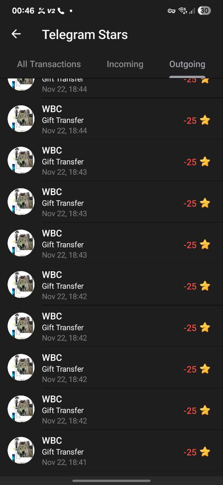</td>
<td>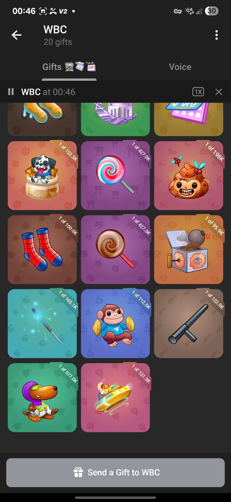</td>
</tr>
</table>

## Aloyya = вор + киберпреступник

Человек с данного аккаунта отправлял голосовые сообщения в целях поугарать над моим кентом. В данных голосовых не был применен VoiceChanger и немного прислушавшись можно сопоставить этот голос и голос с ютуб канала алойи

Данные голосовые и все остальные пруфы я залью в телеграм канал: [@cumpanyruzt](https://t.me/cumpanyruzt)

## Наши фанаты

Администрация проекта с левых аккаунтов начала следить за нашими каналами и пытается выяснить больше инфы о нас  

А так же пишут в лс с таких же аккаунтах и закидывают мертвые аккаунты в чаты.

## Авторы статьи:
[@clawclouds](t.me/clawclouds) 
[@win32_vmprotect](https://t.me/win32_vmprotect)

 
